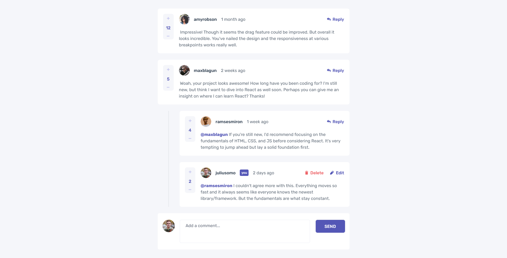

# Frontend Mentor - Interactive comments section solution

This is a solution to the [Interactive comments section challenge on Frontend Mentor](https://www.frontendmentor.io/challenges/interactive-comments-section-iG1RugEG9).

## Table of contents

- [Overview](#overview)
  - [The challenge](#the-challenge)
  - [Screenshots](#screenshots)
  - [Links](#links)
- [My process](#my-process)
  - [Built with](#built-with)
  - [What I learned](#what-i-learned)
- [Author](#author)
- [Acknowledgments](#acknowledgments)

## Overview

### The challenge

Users should be able to:

- View the optimal layout for the app depending on their device's screen size
- See hover states for all interactive elements on the page
- Create, Read, Update, and Delete comments and replies
- Upvote and downvote comments
- `localStorage` to save the current state in the browser that persists when the browser is refreshed.
- `Timestamps` and dynamically track the time since the comment or reply was posted.

## Screenshots

### **Desktop View**

### **Mobile View**

### Links

- Solution URL: [Solution URL](https://github.com/sazzad4677/Interactive-comments-section)
- Live Site URL: [Live Site URL](https://interactive-comments-bd.netlify.app/)

## My process

### Built with
- Semantic HTML5 markup
- CSS custom properties
- CSS Flexbox
- Mobile-first workflow
- [React](https://reactjs.org/) - JS library
- [Tailwind CSS](https://tailwindcss.com/) - Utility-first CSS framework

### What I learned
- I was able to reinforce my knowledge of flexbox and obtain a better understanding of how it works.
- I learned how to utilize a custom hook to prevent duplicating code.
- I learned how to calculate timestamps and dynamically track the time.
- I learned how to work with nested structures.

## Author
- Linkedin - [Md. Sazzad Hossain](https://www.linkedin.com/in/sazzad4673/)
- Frontend Mentor - [@sazzad4677](https://www.frontendmentor.io/profile/sazzad4677)

